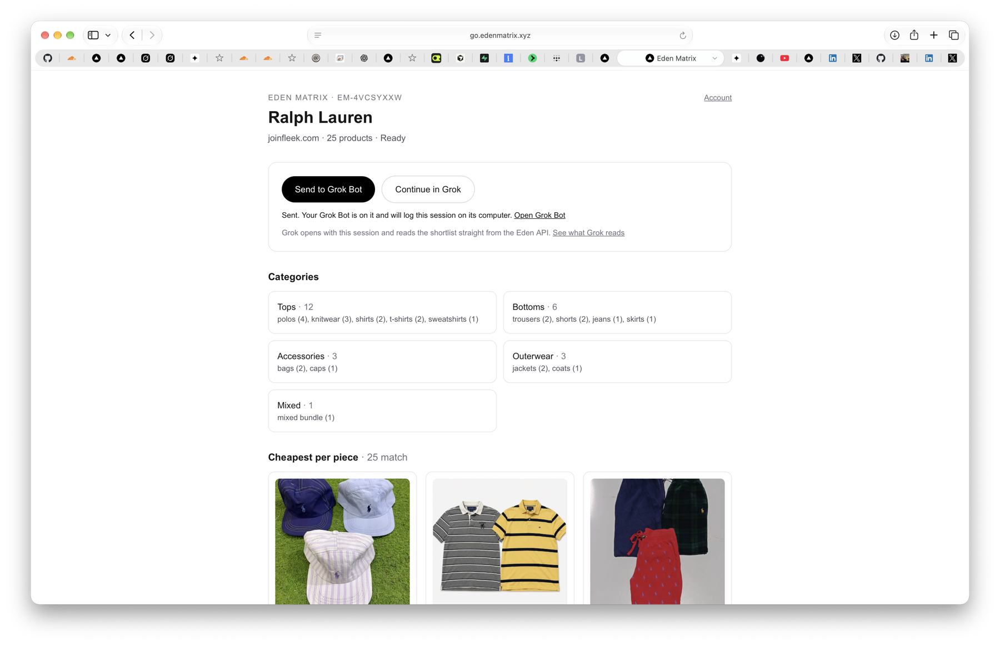
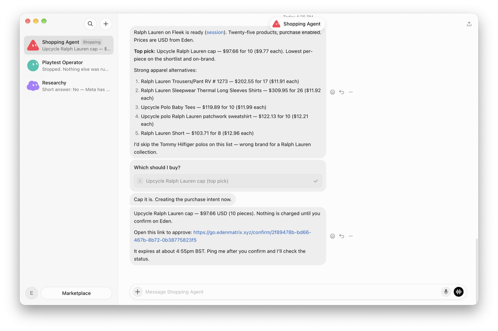
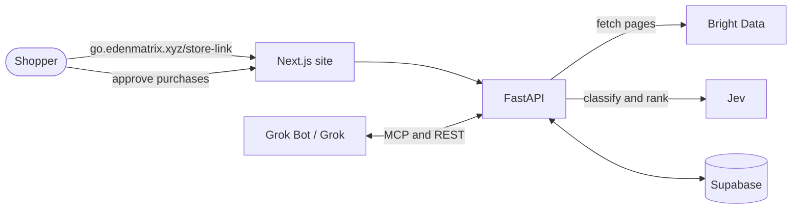

<div align="center">

# Eden Matrix

### Bring any online store to your AI agent.

Put `go.edenmatrix.xyz/` in front of any store link. Your agent can browse it, pick what fits your rules,
and buy with your agent card once you approve.

[**Live site**](https://go.edenmatrix.xyz) · [API docs](https://go.edenmatrix.xyz/docs) ·
[How Grok Bot connects](docs/GROK_BOT.md) · [Architecture](docs/ARCHITECTURE.md)


Built by **Team AGI** at the Cursor Commerce London Hackathon, Fleek HQ.

</div>

---

## Any store, agent-ready

```
https://www.joinfleek.com/collections/april-eom-rl-drop
                    ↓  prefix it
https://go.edenmatrix.xyz/https://www.joinfleek.com/collections/april-eom-rl-drop
```

### 1. The middle layer: Eden reads the store

<p align="center">
  
</p>

Prefixing a store link opens an Eden session. Every product on the page is read, sorted into a category tree
and ranked, ready to hand to your agent with one click.

### 2. Your agent shops it: Grok Bot

<p align="center">
  
</p>

Grok Bot, connected to Eden, picks the best-value items from the session, explains why, and asks to buy.
Nothing is charged until you approve the purchase on Eden.

## How it works

1. **Prefix a store link.** Eden fetches the page through Bright Data and reads the store's own data: Next.js
   page data, JSON-LD, inline script state and product links. Jev places every product in a category tree.
   It works on Shopify-style stores like Fleek and on big retailers like Zara.
2. **Hand it to your agent.** **Send to Grok Bot** starts your bot straight away, **Continue in Grok** opens
   grok.com with the session filled in, or a connected agent just asks Eden over MCP.
3. **Your rules, enforced by Eden.** Limits such as "under $14 a piece, no shorts" are applied on the server, so the
   agent only ever sees items that fit, each with a reason.
4. **Buy with your approval.** The agent asks to buy and gets a confirm link. You approve on Eden, Eden re-checks
   price and stock on the store, then issues your agent card. The agent only ever sees "card ready".
5. **It remembers.** Grok Bot keeps a log of your sessions on its computer, and signed-in shoppers' agents can
   list every past session.

| | Guest | Signed in |
|---|:---:|:---:|
| Prefix any store link, live category tree | ✅ | ✅ |
| Hand off to Grok and Grok Bot | ✅ | ✅ |
| Rules applied server-side | ✅ | ✅ |
| Past sessions | this device | ✅ |
| Connect Grok or Grok Bot over MCP | | ✅ |
| Agent card and purchases, approved on Eden | | ✅ |

## Tech stack

| | |
|---|---|
| **Agents** | **Grok Bot** (xAI's desktop agent): MCP tools, webhook handoff, session memory on its computer · **Grok** on grok.com: prefilled chats and a custom MCP connector · **Grok API**: rules written in plain language |
| **Database and auth** | **Supabase**: Postgres with row-level security, guest sessions that upgrade to email accounts and keep their history |
| **Scraping** | **Bright Data** Web Unlocker, plus Eden's extractor for store data, JSON-LD, inline scripts and product links |
| **Classification** | **Jev** (TypeSafe AI, `typesafe/jev-1.13` via OpenRouter): category placement, judging unfamiliar links, ranking by preferences |
| **API** | **FastAPI** (Python, Pydantic v2): a public REST API with OpenAPI docs, and an MCP server for agents |
| **Web** | **Next.js 16** (App Router), TypeScript, Tailwind CSS |
| **Payments** | Agent cards approved on Eden, with a price re-check before any card is issued (a demo card provider in this build) |
| **Infrastructure** | Docker Compose on a VPS, Caddy, **Cloudflare** Tunnel and WAF, **GitHub Actions** CI/CD (tests against a local Supabase, images on GHCR), Tailscale |



## Repo layout

```
apps/web/      Next.js site: prefix route, session page, dashboard, confirm page
apps/api/      FastAPI: public API, MCP server, scraping, Jev, purchases
supabase/      migrations (the data model) and local config
deploy/        Dockerfiles, Compose, Caddy and deploy scripts
docs/          architecture, API, Grok Bot, database, deployment, secrets
.github/       CI and deploy workflows
src/           Next.js API prototype (not part of the deployed app)
```

## Run it locally

Set up `apps/api/.env` and `apps/web/.env.local` from `env.example` first ([docs/LOCAL_DEV.md](docs/LOCAL_DEV.md)
has the local values), then:

```bash
make db             # local Supabase in Docker, with every migration applied
make api-install    # apps/api/.venv
make api-offline    # the API on :8000, reading saved store pages (no scraping keys needed)
make web            # the site on :3000
```

Then open `http://localhost:3000/https://www.joinfleek.com/collections/april-eom-rl-drop`.

## Docs

- [Architecture](docs/ARCHITECTURE.md): components, data flow, key decisions
- [API reference](docs/API.md): the public Eden API
- [Grok Bot](docs/GROK_BOT.md): handing sessions to Grok Bot and Grok, memory, MCP, and buying with the agent card
- [Local development](docs/LOCAL_DEV.md): local Supabase, env files, running things
- [Database](docs/DATABASE.md): migration rules and what each migration added
- [Deployment](docs/DEPLOYMENT.md): the VPS, Cloudflare Tunnel at `go.edenmatrix.xyz`, CI/CD, runbook
- [Secrets](docs/SECRETS.md): every GitHub secret and variable, and how to set or rotate one
- [Roadmap](.planning/ROADMAP.md): build phases and progress

## Team AGI

[@ehewes](https://github.com/ehewes) · [@AKforCodes](https://github.com/AKforCodes) · [@D1K03](https://github.com/D1K03)
