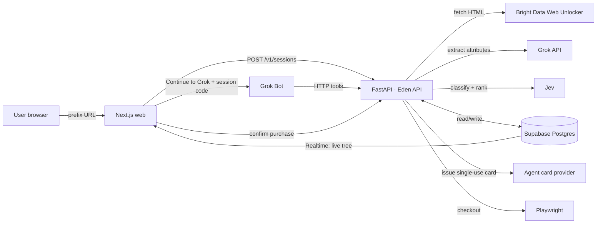

# Architecture

## Goal

Turn any store page into structured, agent-queryable data in seconds, and let an agent act on it within rules the user controls — with purchases gated behind explicit human confirmation and scoped payment credentials.

## Components

| Component | Responsibility |
|---|---|
| **Next.js (`apps/web`)** | Catch-all prefix route, continue page (rules + "Continue to Grok"), session page (preview cards), dashboard (rulesets, agent card, sessions, purchases), purchase confirmation page |
| **FastAPI (`apps/api`)** | Public Eden API; scrape pipeline; Jev classification/ranking; rule application; purchase intents; card issuance + checkout |
| **Supabase** | Postgres (source of truth), auth (anonymous + email), RLS, Realtime for scrape progress, Vault for card-provider credentials |
| **Bright Data** | Fetching pages through Web Unlocker (handles blocking/CAPTCHAs) |
| **Jev** | Typed Choice/Score evaluations: category tree placement, ranking against rules |
| **Grok API** | Structured attribute extraction from product pages; turning plain-language rules into structured rules |
| **Grok Bot** | The conversational agent the user talks to; calls the Eden API as tools |

## Flows

### 1. Session creation + scrape

1. User visits `edenmatrix.com/<target-url>`. The catch-all route rebuilds the target URL (fixing `https:/` → `https://`) and calls `POST /v1/sessions`.
2. API validates the domain against the allowlist, creates a `scrape` (or reuses a fresh cached one) and a `session`, returns immediately (`202`).
3. Background task:
   - Fetch collection page via Bright Data → parse product links (page 1 only for the demo).
   - Fetch product pages concurrently (semaphore ~5–10), caching raw HTML in `page_cache`.
   - Extract structured attributes (pieces, grade, sizes, per-piece price) with the Grok API.
   - Place each product in the tree with Jev Choice questions, level by level (category → type → tier).
   - Upsert into `products`; update `scrapes.status` as it goes.
4. The page subscribes to `products`/`scrapes` via Realtime and renders the tree as it builds.

The "Continue to Grok" choice is shown over the building tree, so scrape latency is hidden behind the user's first decision.

### 2. Recommendation (guest or signed-in)

1. User sets rules on the continue page (typed in plain language → structured via Grok → shown as removable chips). Rules are stored on the session.
2. "Continue to Grok" opens Grok Bot with a prefilled message containing the session code (exact handoff mechanism depends on Grok Bot's capabilities — see Open questions).
3. Grok calls `GET /v1/sessions/{code}` then `GET /v1/sessions/{code}/products?...`. **Rules are applied server-side**, so Grok receives a pre-filtered, ranked shortlist with a `why` per item.
4. The API writes the picks to `session_picks`; the session page (`/s/{code}`) renders them as preview cards from the database.

### 3. Purchase (signed-in only)

*As built (2026-09-26):* the agent reaches this through the MCP tool `create_purchase_intent` on `/v1/mcp`,
authenticated by an agent token from the dashboard, rather than a REST call. The card is a demo card and checkout
is a demo checkout. Details and the safety rules are in [GROK_BOT.md](GROK_BOT.md).

1. User asks Grok to buy → Grok calls `POST /v1/sessions/{code}/purchase-intents`.
2. API refuses if the session owner is anonymous or has no linked card. Otherwise it re-fetches the chosen products (fresh price + stock), records a `pending` intent with the quoted total, and returns a `confirm_url`.
3. User opens the link on Eden (must be signed in as the session owner) → confirmation card: items, total, merchant, card limit. If prices changed since quoting, show the diff and require re-confirmation.
4. Confirm → API issues a single-use card locked to amount (+ small buffer) and merchant, short expiry → Playwright runs checkout with the card details injected by code → intent → `completed`, receipt stored.

## Data model

See `supabase/migrations/0001_init.sql`.

| Table | Purpose | Access |
|---|---|---|
| `scrapes` | One per URL snapshot; status + counts | Public read |
| `products` | Parsed products, tree path, attributes | Public read |
| `page_cache` | Raw fetched HTML keyed by URL | Service role only |
| `sessions` | Session code, owner, scrape, rules snapshot, expiry | Owner read |
| `session_picks` | Grok's recommendations for a session | Owner read (API serves by code) |
| `rulesets` | Saved rulesets | Owner read/write |
| `card_links` | Provider + Vault reference (never raw keys) | Owner read; API writes |
| `purchase_intents` | Pending → confirmed → completed purchases | Owner read; API writes |

FastAPI uses the service role key and bypasses RLS; it enforces ownership itself. The browser only ever uses the anon key.

## Key decisions

| Decision | Why |
|---|---|
| **Public REST API, not MCP-first** | Simpler to build and debug; auto OpenAPI from FastAPI; an MCP wrapper (e.g. `fastapi-mcp`) can be added in an hour if Grok Bot requires it. |
| **Scrape is rule-independent** | Scrape/classify once per URL and share the cache; rules are cheap query-time filters. |
| **Rules applied server-side** | Grok can't "forget" a rule mid-conversation; deterministic filtering; Jev scores the fuzzy parts. |
| **Supabase anonymous auth for guests** | One code path for guests and users; guest rules persist on the device; sign-up links the anonymous user so data carries over. `is_anonymous` gates purchasing. |
| **Session code = read-only capability** | Codes appear in chat, so they can read one session's data but can never authorise spending. |
| **Purchases confirmed on Eden, not in chat** | An LLM never interprets "yeah go on" as payment authorisation; confirmation is a signed-in button press. |
| **Card details never enter LLM context** | Grok decides *what* to buy; code fetches and fills card details. |
| **Prices always come from the DB** | Preview cards and confirmation are rendered from stored data, never from model text. |
| **Rules + card = defence in depth** | The card enforces *how much / where* at the network level; rules enforce *what / whether it's a good buy*. |

## Security

- Domain allowlist on scraping (prevents server-side request forgery and abuse).
- Rate limits on `POST /v1/sessions` per IP / user; CAPTCHA on anonymous sign-in if abused.
- Session codes: long, random, expiring.
- Service role key and Bright Data / Jev / Grok / card keys live only in the API environment.
- Card provider credentials stored in Supabase Vault; `card_links` holds only a reference.

## Open questions

- **Grok Bot handoff:** deep link with prefilled message? URL params? How does it register external HTTP tools (OpenAPI import, custom functions, MCP only)? → ask sponsor team first thing.
  - *Partly answered 2026-09-26*, from the installed app (v0.59.1, `Info.plist` and `app.asar`).
  - It registers `grokbot://` (and `sand://`). The routes are `app/v1/open`, `app/v1/agent?id=`,
    `app/v1/bot-template?id=`, marketplace, plugins and settings. None of them carries a prompt.
  - So the session page's **Open in Grok Bot** copies the prompt, then opens `grokbot://app/v1/open`, and the
    shopper pastes the prompt in. **Continue in Grok** (`grok.com/?q=`) stays for the web and phones.
  - The app connects to remote MCP servers with OAuth (its callback is `grokbot://mcp/oauth/callback`). That is
    the way to give it tools.
- **Checkout on Fleek:** account, cart and possible 3-D Secure; real money. → ask Fleek about a test account; otherwise demo purchase on our Shopify dev store.
- **Agent card sandbox:** does the provider offer test mode?
