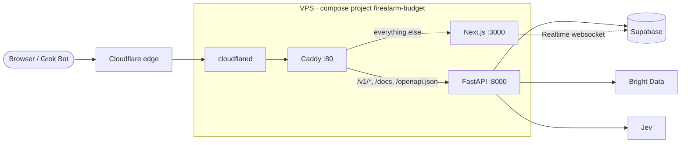

# Deployment

Production runs on the team VPS behind a Cloudflare Tunnel, deployed from GitHub Actions. This page is the
setup and the runbook. The files it describes:

| File | What it is |
| --- | --- |
| `deploy/api.Dockerfile`, `deploy/web.Dockerfile` | The two images (build context is the repo root) |
| `deploy/compose.yml` | Caddy and the API |
| `deploy/compose.web.yml` | The web app, added once `apps/web` exists |
| `deploy/compose.tunnel.yml` | This project's cloudflared |
| `deploy/caddy/Caddyfile` | Path routing and headers |
| `deploy/render-env.sh` | Writes the production `.env` from GitHub secrets (runs on the runner) |
| `deploy/remote-deploy.sh`, `deploy/smoke.sh` | The rollout and the post-deploy checks (run on the VPS) |
| `.github/workflows/ci.yml`, `deploy.yml` | CI on every PR; deploys from `main` |

## Where it runs

| | |
| --- | --- |
| Public URL | `https://go.edenmatrix.xyz`: the web app at `/`, the API at `/v1` (plus `/docs`, `/openapi.json`) |
| Host | `ehewesagents`: Debian 13, 4 vCPU, 15 GiB RAM, no swap. It is shared with five other stacks |
| Access | `ssh deploy@100.102.111.88`, **over Tailscale only** (public SSH is closed) |
| App directory | `/opt/firealarm-budget`: compose files plus a `.env` rendered by CI. No git checkout |
| TLS | Terminated by Cloudflare. Inside the box everything is plain HTTP on a private Docker network |

**Why `go.edenmatrix.xyz`:** `edenmatrix.com` is not ours; it is parked for sale at HugeDomains. The team's
Cloudflare zone is `edenmatrix.xyz`, whose apex (the Eden Matrix landing page), `screener.` and `terminal.`
are already used. One subdomain level keeps Cloudflare's free certificate valid; a name like
`api.go.edenmatrix.xyz` would not be covered. So the API lives on the same host under `/v1`, which also means
the browser never makes a cross-origin call.

With that, the web app's `NEXT_PUBLIC_API_URL` is `https://go.edenmatrix.xyz/v1`, and Grok Bot calls the same
`/v1/sessions/{code}/…` endpoints described in [API.md](API.md).

## Topology



| Service | Image | Limits | Notes |
| --- | --- | --- | --- |
| `caddy` | `caddy:2.10-alpine` | 128 MB | Path routing and security headers. Its config directory is bind-mounted and reloaded on every deploy |
| `web` | `ghcr.io/ehewes/firealarm-budget-web:<sha>` | 1 CPU, 384 MB | Next.js standalone. `NEXT_PUBLIC_*` values are baked in at build time. Only runs once `apps/web` exists; until then Caddy answers non-API paths with a short "not deployed yet" message |
| `api` | `ghcr.io/ehewes/firealarm-budget-api:<sha>` | 1 CPU, 512 MB | FastAPI with scrapes running as `BackgroundTasks` |
| `cloudflared` | `cloudflare/cloudflared` (pinned) | 128 MB | This project's own tunnel, token-based. It joins only this project's network |

Nothing publishes a host port. The only way in is the tunnel, which is also why `CF-Connecting-IP` can be
trusted for rate limiting.

Supabase Realtime (the live tree) connects from the browser straight to Supabase over a websocket, so it does
not pass through the tunnel. cloudflared buffers server-sent events, so don't stream responses through it.

**Scrapes run inside the API process.** A deploy restarts the API, which kills any scrape in flight. On
startup the API marks scrapes still `pending`, `crawling` or `classifying` with no progress for 10 minutes
(`scrapes.updated_at`) as `failed`, so no session spins forever.

## How a deploy happens

1. A PR merges to `main`. CI runs; the deploy job runs **only after CI passes**, and **only when the repo
   variable `DEPLOY_ENABLED` is `true`**.
2. **Migrate:** `supabase db push --db-url "$SUPABASE_DB_URL"` applies any new migration. Migrations must stay
   compatible with the version still running.
3. **Build:** both images are built and pushed to GHCR as `:<commit sha>` and `:latest`.
4. **Ship:**
   - The runner joins the tailnet as an ephemeral `tag:ci` node.
   - It renders `.env` from GitHub secrets and variables, including `IMAGE_TAG=<sha>`, so a manual
     `compose up` on the box can never fall back to a stale `latest`.
   - It copies that `.env` and the compose files to `/opt/firealarm-budget`.
5. **Roll out over SSH:**
   - Remove this project's superseded image tags (only ours; the disk filled up on 2026-09-15 without this).
   - `docker compose pull && docker compose up -d --remove-orphans`.
   - `caddy reload`.
6. **Smoke test** (`deploy/smoke.sh`) from inside the containers, never through the tunnel. It checks the API
   answers `/v1/ready` (so the database is reachable), Caddy routes `/v1` (and `/` once the web app is deployed),
   and every service is running.

Every compose call on the box has the same shape. `--env-file` is not optional: without it, compose looks for
`.env` next to the compose file and silently uses defaults. Add `-f deploy/compose.web.yml` once the web app is
deployed (`.env` then has `WEB_ENABLED='true'`; the scripts check it).

```sh
cd /opt/firealarm-budget
docker compose --env-file .env -f deploy/compose.yml -f deploy/compose.tunnel.yml [-f deploy/compose.web.yml] <command>
```

**The web app's contract with the deploy:** `apps/web` must have a `package-lock.json` and set
`output: "standalone"` in `next.config`. It must answer `GET /` with a 200 (the healthcheck), and read its
public settings from the `NEXT_PUBLIC_*` variables in [SECRETS.md](SECRETS.md). CI starts building and deploying
it the moment `apps/web/package.json` exists on `main`.

## Rollback

Run the deploy workflow by hand with an older commit SHA as `image_tag`. It skips the build and points the box
at images that already exist in GHCR:

```sh
gh workflow run deploy.yml -f image_tag=<previous sha>
```

Migrations are roll-forward only; a rollback never undoes schema changes.

## Runbook

```sh
ssh deploy@100.102.111.88
cd /opt/firealarm-budget
C="docker compose --env-file .env -f deploy/compose.yml -f deploy/compose.tunnel.yml"
# plus: C="$C -f deploy/compose.web.yml" once the web app is deployed

$C ps                        # what is running, and health
$C logs --tail=100 api       # API and scrape logs
$C logs --tail=50 cloudflared
$C restart api               # restarts kill in-flight scrapes (see above)
df -h /                      # the disk is shared: keep an eye on it
```

Never run `docker image prune -a` or restart other projects' containers. Other stacks on this box run images
that exist in no registry.

## One-time setup

Done once, by hand. Paste secrets only into `gh secret set` prompts, never into chat. See
[SECRETS.md](SECRETS.md) for every name.

**Supabase** (a new hosted project, in Frankfurt to be near the VPS):
1. Enable anonymous sign-ins (Authentication > Providers).
2. Set Site URL `https://go.edenmatrix.xyz`, with redirect URLs `https://go.edenmatrix.xyz/**` and
   `http://localhost:3000/**`.
3. Turn off "Confirm email" or add custom SMTP. The built-in mailer only emails the project team, at about
   two messages an hour.
4. Copy the URL, the anon (publishable) key and the service role (secret) key, plus the
   **Session pooler** connection string (Connect > Session pooler; GitHub runners are IPv4-only).

**Cloudflare** (Zero Trust, zone `edenmatrix.xyz`):
1. Networks > Tunnels > Create a tunnel, named `firealarm-budget`, connector type Cloudflared. Its token goes
   into the `CLOUDFLARE_TUNNEL_TOKEN` secret.
2. Add a public hostname: `go.edenmatrix.xyz` → service `HTTP` → `caddy:80`.
3. The zone blocks AI bots at the edge, which would block Grok Bot. Add a WAF custom rule that skips that for
   this host's agent-facing paths only:
   `(http.host eq "go.edenmatrix.xyz" and (starts_with(http.request.uri.path, "/v1/sessions/") or http.request.uri.path in {"/v1/mcp" "/openapi.json" "/robots.txt" "/llms.txt"}))`
4. Check that managed robots.txt isn't adding disallow rules for this host.

**Tailscale:** create an OAuth client with the Auth Keys (write) scope and tag `tag:ci`, and set
`TS_OAUTH_CLIENT_ID` and `TS_OAUTH_SECRET`. The other repos use auth keys that expire in November and December
2026; an OAuth client does not. A reusable, ephemeral `tag:ci` auth key in `TS_AUTHKEY` also works as a fallback.

**VPS** (safe alongside the other stacks):
1. `sudo install -d -o deploy -g deploy -m 750 /opt/firealarm-budget`
2. Add a dedicated CI key to `~deploy/.ssh/authorized_keys`, restricted to the tailnet:
   `from="100.64.0.0/10",no-port-forwarding,no-agent-forwarding,no-X11-forwarding ssh-ed25519 … firealarm-budget-github-actions`
3. Its private half becomes the `VPS_SSH_KEY` secret.

**Bright Data:** a dedicated Web Unlocker zone for this project (its own cost line), with a spend limit set in
Bright Data too. **OpenRouter / Jev:** a key with a credit limit.

**Last:** set `DEPLOY_ENABLED` to `true`.

## Verifying production

```sh
curl -s https://go.edenmatrix.xyz/v1/health
curl -s -o /dev/null -w '%{http_code}\n' -A 'Claude-User/1.0' https://go.edenmatrix.xyz/v1/sessions/EM-XXXXXXXX
```

The second request should return 404 (from our API, meaning the edge let it through), not 403 from Cloudflare.
