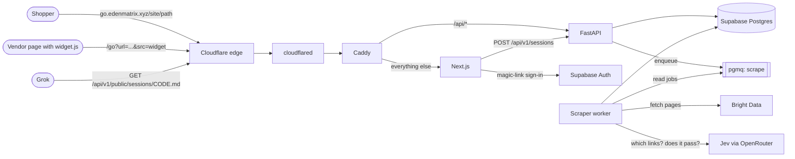
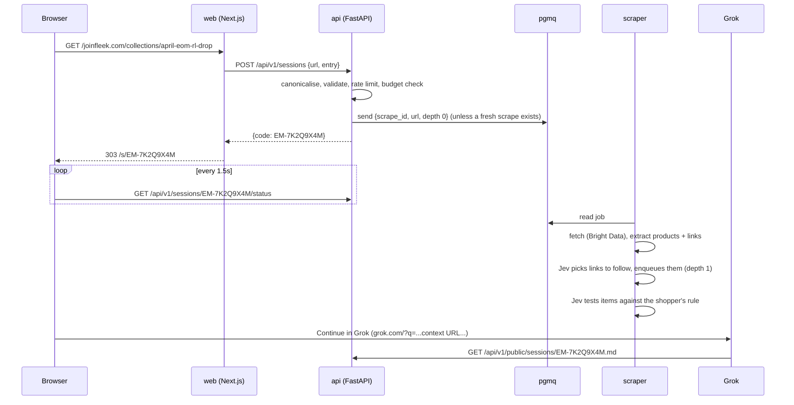

# Architecture

## What it does

A shopper on `https://www.joinfleek.com/collections/april-eom-rl-drop` changes the address to
`https://go.edenmatrix.xyz/joinfleek.com/collections/april-eom-rl-drop`. We:

1. create a **session** straight away and send them to a minimal page (`/s/EM-7K2Q9X4M`);
2. scrape the page in the background through Bright Data, extract its products and links, and let **Jev**
   pick which links are worth following (the product pages, the next page of the listing);
3. if the shopper is signed in and has a rule ("only pants"), ask Jev which items pass it;
4. once the page is in, enable **Continue in Grok**, which opens `grok.com/?q=…` with a prompt that points
   Grok at the session's public context URL. Grok fetches that text and answers questions over it.

Vendors can skip the address trick: a floating button from `widget.js` sends the shopper to
`/go?url=<current page>&src=widget`, and the same thing happens.

## Components

| Service | Folder | Runs as | Talks to |
| --- | --- | --- | --- |
| web | `apps/web` | Next.js standalone server, :3000 | API (internal), Supabase Auth |
| api | `apps/api` | uvicorn, :8000 | Postgres, pgmq |
| scraper | `apps/scraper` | `python -m scraper`, no port | pgmq, Postgres, Bright Data, OpenRouter |
| widget | `apps/widget` | a static `widget.js` served by web | nothing; it only navigates |
| caddy | `deploy/caddy` | reverse proxy, :80 | web, api |
| cloudflared | `deploy/compose.tunnel.yml` | tunnel connector | caddy |

Supabase is hosted (supabase.com). Nothing database-shaped runs on the VPS.

## A request, end to end

## Decisions worth knowing

- **One tunnel, one Caddy per app.** This matches the other stacks on the shared VPS (stock-aggregator,
  scrape-terminal). cloudflared only joins this project's compose network, so a mistake here cannot route
  traffic into another stack.
- **One hostname, routed by path.** `/api/*` goes to FastAPI and everything else to Next.js, so there is no
  CORS surface. `go.edenmatrix.xyz` is a single subdomain level, which Cloudflare's free certificate covers.
- **pgmq (Supabase Queues) for jobs, not Redis.** The queue lives in the same database, so enqueueing a
  job and creating its session happen in one transaction. A crashed worker's job comes back when its
  visibility timeout expires.
- **The Python services talk to Postgres directly** (Supavisor session pooler, `postgres` role) rather than
  through the REST API: the queue needs SQL, and transactions matter. The browser never touches data
  tables; it only uses Supabase for sign-in.
- **Polling, not server-sent events.** cloudflared buffers SSE, so a stream would arrive all at once.
- **Jev decides; it never writes.** Link choice and rule matching are typed questions with probabilities.
  `choice` answers run overconfident, so they get a high threshold; yes/no (`noul`) answers run
  underconfident, so they make safe gates. Without a key, or past the monthly budget, URL heuristics and
  keyword matching take over.
- **Secrets live in GitHub.** Unlike the sibling repos (Infisical), every deploy rewrites the VPS `.env`
  from GitHub secrets, so the box never drifts from the repo settings.
- **The schema grows by addition.** `0001_init.sql` is D1K03's original design (scrapes, products,
  sessions, picks, rulesets, card links, purchase intents). Everything since is a new migration.
- **Public sessions are capabilities.** Anyone with a session code can read its context; that is what lets
  Grok read it. Codes are random, sessions expire after 24 hours, and the context never includes who made it.

## Where things are not built yet

Agent-card linking, the verification layer and purchases are designed in the schema (`card_links`,
`purchase_intents`) but have no code. See [roadmap.md](roadmap.md).
